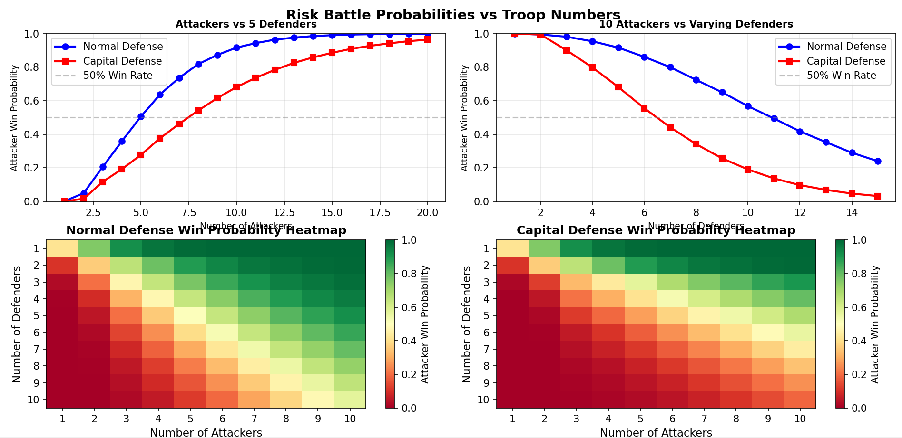
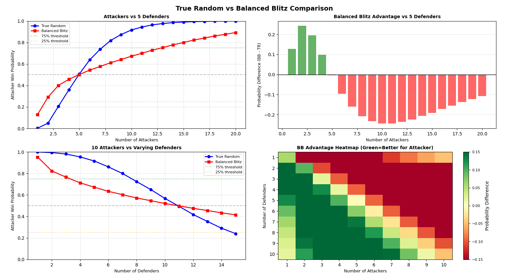

# Risk Battle Dice

This code reveals Risk battle probabilities for my personal amusement. Use these figures at your own *Risk*.

## Getting Started

```sh
pip install matplotlib
python battle.py
```

## Results

### Classic Boardgame



### Global Domination

This chart shows balanced blitz diced in comparison with true random (classic boardgame). The two charts on the right are advantages in comparison with true random.

